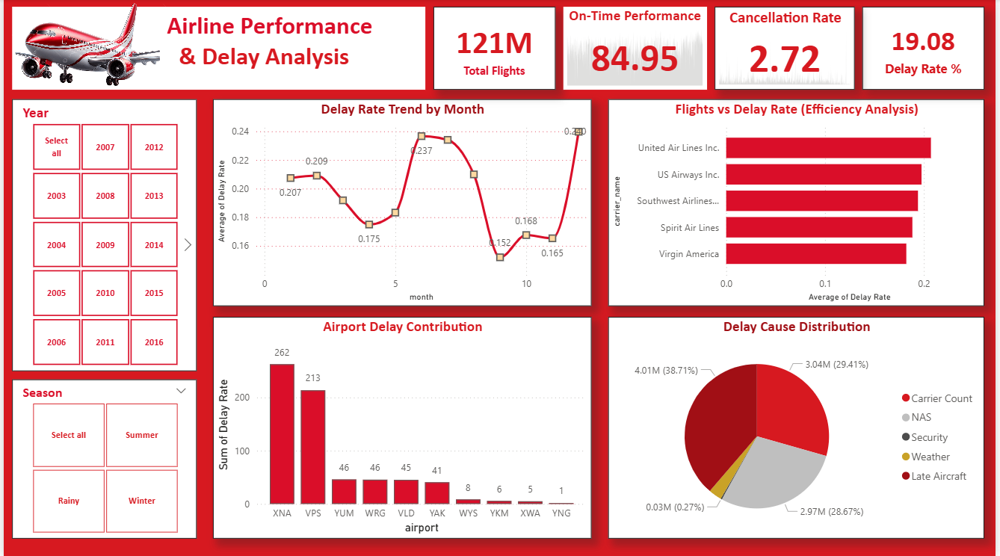
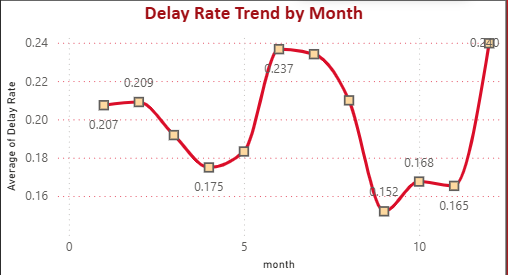
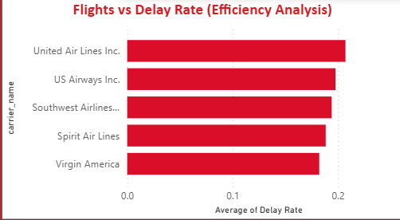
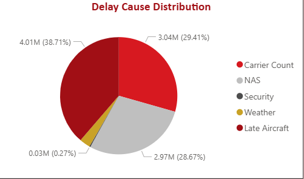

# 🛩️ Airline Performance & Delay Analysis Dashboard

# ✈️ About the Aviation Industry

The aviation industry plays a critical role in global transportation, connecting millions of passengers and supporting international trade and tourism.

Airline operations generate massive amounts of data related to flight schedules, delays, cancellations, airport congestion, and operational efficiency. Analyzing this data helps airlines improve punctuality, reduce operational costs, and enhance passenger experience.


---

## 📌 Project Overview

This project presents an interactive Airline Performance & Delay Analysis Dashboard developed using Power BI during a data analytics hackathon.  

The dashboard provides detailed insights into airline operational performance, delay trends, cancellation rates, airport delay contribution, and major causes of delays. It helps identify operational inefficiencies and supports data-driven decision-making for improving airline performance.

---

## 🎯 Project Objective

The primary objectives of this project are:

- Analyze airline operational efficiency
- Monitor on-time flight performance
- Identify major delay causes
- Understand airport-wise delay contribution
- Compare airline performance based on delay rates
- Discover seasonal and monthly delay patterns

---

## 🛠️ Tools & Technologies Used

- DAX
- Power Query
- Data Cleaning
- Data Visualization

---

# 📊 Dashboard Preview



---


# ❓ Business Questions & Analysis

---

## 1️⃣ How do delay rates vary across different months and seasons?

The dashboard analyzes monthly and seasonal delay trends to identify peak delay periods and operational traffic patterns.



### 🔍 Insight
Delay rates increased during certain months, indicating seasonal operational pressure and higher air traffic congestion.

### 💡 Recommendation
Airlines should optimize scheduling and allocate additional operational resources during peak delay periods.

---

## 2️⃣ Which airlines have the highest average delay rates?

The dashboard compares airlines based on average delay rates to evaluate operational efficiency and punctuality performance.



### 🔍 Insight
Some airlines consistently recorded higher average delay rates, reflecting lower operational efficiency.

### 💡 Recommendation
Airlines should improve turnaround management, crew coordination, and scheduling efficiency to reduce delays.

---

## 3️⃣ Which airports contribute the most to flight delays?

Airport-wise delay contribution analysis helps identify airports that significantly impact overall flight delays.



### 🔍 Insight
A small number of airports contributed disproportionately to total delays, suggesting congestion bottlenecks.

### 💡 Recommendation
Airport authorities should improve traffic flow management and operational resource allocation during peak hours.

---

## 4️⃣ What are the major causes of flight delays?

The dashboard categorizes delays into carrier issues, weather, NAS, security, and late aircraft delays to identify primary operational challenges.


### 🔍 Insight
Carrier-related issues and late aircraft arrivals accounted for the majority of delays.

### 💡 Recommendation
Airlines should strengthen predictive maintenance systems and improve operational coordination to minimize cascading delays.

---
# 🔍 Key Insights

- Total Flights analyzed exceeded **121 million**
- Overall On-Time Performance recorded at approximately **84.95%**
- Delay Rate observed around **19.08%**
- Carrier-related issues and late aircraft were major contributors to delays
- Certain airports showed significantly higher delay contribution compared to others
- Delay rates increased during specific months, indicating seasonal operational pressure

---

# 📈 Business Summary

The analysis reveals that while the majority of flights operate on time, delays remain a significant operational challenge for airlines.  

Carrier-related operational inefficiencies and late aircraft arrivals are among the primary factors driving delays. Certain airports consistently contribute more heavily to overall delays, suggesting congestion and operational bottlenecks.

Seasonal trends also indicate that flight performance fluctuates during different times of the year, which can impact customer satisfaction and operational planning.

---

# 💡 Recommendations

- Improve aircraft turnaround efficiency to reduce late aircraft delays
- Optimize scheduling during high-delay seasons
- Increase operational monitoring at high-delay airports
- Enhance predictive maintenance strategies
- Improve coordination between airline operations and airport authorities
- Use real-time analytics for proactive delay management

---

# 📌 Dashboard Features

- KPI Cards
- Interactive Filters & Slicers
- Monthly Delay Trend Analysis
- Airline Efficiency Comparison
- Airport Delay Contribution Analysis
- Delay Cause Distribution
- Seasonal Performance Insights

---

# 📂 Project Structure

```text
Airline-Performance-Analysis/
│
├── Dataset/
├── Dashboard/
├── Images/
├── README.md
└── Airline_Performance.pbix
```

---

# 🚀 Conclusion

This project demonstrates the use of Power BI for transforming raw airline operational data into actionable business insights through interactive visualizations and analytical dashboards.

The dashboard enables stakeholders to monitor performance, identify operational inefficiencies, and support strategic decision-making using data-driven analysis.

---
Author
Snehashish Pradhan
